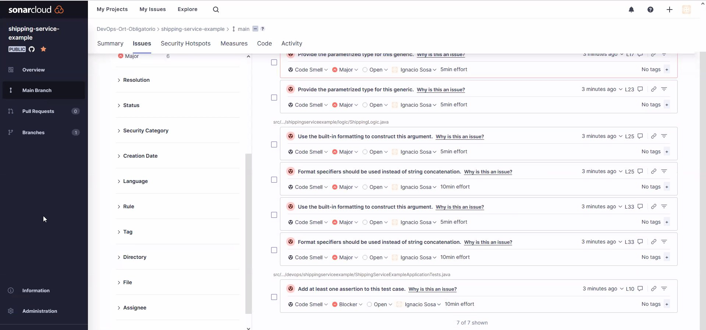

# Obligatorio
0. [Introducción](#id0)
1. [Herramientas](#id1)
2. [Kanban](#id2)
3. [Gitflow](#id3)
4. [ManejoRepositorio](#id4)
5. [PruebasCódigo](#id5)
6. [InfraestructuraComoCódigo](#id6)
7. [Postman](#id7)
8. [CI/CD](#id8)

## Introducción <a name="id0"></a> 
Este documento va a detallar todas las tareas, herramientas e información utilizada para la realización del proyecto.

El problema se describe en la especificación del obligatorio, del cual resaltamos los aspectos claves del mismo. 

El proyecto que se nos presentó se trata del despliegue de una aplicación en un cloud provider. Además, el cliente quiere mejorar su forma de trabajo. Para lograr esto decidio utilizar DevOps para mejorar el tiempo con el que despliega las aplicaciones y la calidad de las mismas. 

## Herramientas <a name="id1"></a> 
* Docker: es una herramienta que se encarga de ejecutar contenedores y proporcionar un conjunto de comandos. Los cuales se usan para crear, iniciar o detener contenedores.

* Scrum Desk: es un tablero donde se realiza la carga de trabajo a realizar y ayuda a los equipos a relizar una mejor gestion de trabajo.

* Toggle: es una herramienta de registro de horas.

* Postman: es una aplicación que nos permite testear APIs a través de una interfaz gráfica de usuario.

* AWS: es un proveedor de servicios de nube.
* Kubernetes: es una plataforma que se utiliza para la administración de contenedores.
* GitHub: es un repositorio que se utiliza para el control de versiones de las aplicaciones.
* Visual Studio Code: editor de código fuente.
* SonarCloud: es una herramienta que permite realizar pruebas de código estatico.
* Terraform: es una herramienta para desplegar intraestructura utilizando código.

## Kanban <a name="id2"></a> 
Para aplicar Kanban utilizamos la aplicación scrum desk,lo cual generamos nuestro backlog que ponemos como imagen a continuación:

Como se puede ver en la imagen hemos organizado todas las tareas para el desarrollo del proyecto. A partir de esto comenzamos a realizar las tareas y gestionar los tiempos para cada una.

La planificación que hicimos fue en base a Planning Poker donde clasificamos las tareas y lo hicimos antes de cada sprint. Luego de ejecutar el sprint hicimos una review de lo que salió bien, lo que salió mal y lo que se puede mejorar. A continuación se demuestra que utilizamos Planning poker para las clasificaciones de las tareas.

(Va imagen)

Para el registro de las horas utilizamos la herramienta Toggle, donde cargamos las horas de trabajo realizadas por cada integrante. También agregamos una descripción de la tarea que realizamos, ya que con esto podemos ver que horas de trabajo invertimos a cada tarea.


## Gitflow <a name="id3"></a>
## ManejoRepositorio <a name="id4"></a>
## PruebasCódigo <a name="id5"></a>
Las pruebas de código se dividen dos las cuales son:
* Las pruebas auntomatizadas que se ejecutan en cada pipeline, mejor referenciado en la etapa de CI (continous integration).
* La segunda la realizamos en el siguiente punto, la cual es un informe que generamos sobre los resultados obtenidos y recomendaciones a implementar para mejorar la calidad del código.

## Informe
### **Informe sobre orders-service-example**
En la siguiente imagen podemos ver el analísis de código estático realizado con la herramienta SonarCloud. De la cual podemos observar 1 bug, 2 vulnerabilidades de seguridad, 8 code smells y 15.7% de duplicaciones.

A continuación vamos a detallar cada problema.

* BUG:
Vamos a detallar el problema del bug encontrado la cual podemos ver en la siguiente imagen.

El bug refiere a la que está intentando hacer una acción (en el if) sobre un objeto que podría llegar a ser null, por ello nos da la excepción NullPointerException.
Para solucionar este problema bastaría de colocar un if anterior a esta línea, preguntando si el valor del objeto es distinto de null y en caso de que se cumpla la condición va a realizar la acción siguiente. Con esto se quita la posibilidad que el objeto sea null en la condición.

* Vamos a detallar el problema de seguridad que nos dió el resultado, la cual podemos ver en la siguiente imagen

En el archivo OrdesLogic.java, vemos que el problema está en la visibilidad del método buy, la cual es public y se debería de cambiar por protected para que el retorno del mismo no se pueda cambiar.

En el caso del archivo OrderLogic.java, todos los errores que se evidenciaron son sobre la nomenclatura de las variables privadas, las cuales no cumplen con la expresión regular. 

Modificar las variables para que cumplan la expresión regular, siguiendo las buenas prácticas de java.

* El otro problema que pudimos ver fue sobre la cobertura de código, la solución a este problema sería realizar las pruebas de código cubriendo el 100% de cobertura. 

Otra posible solución sería utilizar TDD, al momento de realizar la codificación del microservicio.

En el archivo OrdersServiceExampleApplicationTests.java,
no está completado el test correctamente. La solución sería borrar el test contextLoads(), o hacerlo completo para que podamos probar la cobertura del método que se quiera probar.

* Otro problema que pudimos encontrar fué la duplicación del código como se ve en las imagenes siguientes.

Este problema se debe a que en ambas clases existen los mismos bloques get y set como por ejemplo:

````
public String getOrderId() {
    return orderId;
}

public void setOrderId(String orderId) {
    this.orderId = orderId;
}
````
Una posible solución a este problema sería generando una herencia, en este caso Order. De la cual OrderStatus y PaymentStatus heredarían los metodos de Order.

* Otro problema que encontramos fué que la cobertura de prueba es de un 0% lo cual está mal, debería de ser de un 100%. Lo cual se deben de completar las pruebas unitarias para todos los métodos del microservicio.

### **Informe sobre payments-service-example**
En la siguiente imagen podemos ver el analísis de código estático realizado con la herramienta SonarCloud. De la cual podemos observar 1 bug, 3 code smells y 1 Security hotspots.

A continuación vamos a detallar cada problema.

* BUG: El bug refierte que cada vez que se está invocando el método pay, se está creando un objeto random, lo cual es ineficiente poqué podría llegar el caso de que se pueda crear uno que ya existe. La solución a este problema sería crear un objeto random y luego usar el mismo para crear los siguientes objetos random.


* Code Smells: En este punto encontramos 3 problemas que vamos a mencionar a continuación y a dar una posible solución a los problemas.
  En la siguiente imagen poemos ver los errores.


  Solución:
 1. Invoke method(s) only conditionally. Use the built-in formatting to construct this argument.\
   El problema refiere a que se está concatenando dos string en un metodo de loggin y esto hace que sea ineficiente. 
   Para solucionar este problema se debería de pasar valores pre computados o valores estáticos y no realizar la concatenación
 2. Format specifiers should be used instead of string concatenation.\
   El problema refiere a que no es necesario usar el .toString(), bastaría usar el objeto.
 3. Add at least one assertion to this test case.\
    El problema refierte que se necesita agregar la prueba completa ya que no está correcta. Podría ser con:
    Assert.IsFalse() o Assert.IsTrue()

* Security Hotspots:
  El problema se da que se está usando una forma no segura de obtener un numero random. 
    En la siguiente imagen poemos ver los errores.

  
  Para solucionar este problema podemos utilizar los siguientes soluciones:
  * Utilice un generador de números aleatorios (RNG) criptográficamente fuerte como "java.security.SecureRandom" en lugar de este PRNG.
  * Utilice los valores aleatorios generados solo una vez.
  * No debe exponer el valor aleatorio generado. Si tiene que almacenarlo, asegúrese de que la base de datos o el archivo estén seguros.
  
### **Informe sobre products-service-example**
En la siguiente imagen podemos ver el analísis de código estático realizado con la herramienta SonarCloud. De la cual podemos observar 5 code smells.

A continuación vamos a detallar cada problema.


* Code Smell:
  * Provide the parametrized type for this generic.\
  El error menciona que los tipos genéricos no deben usarse sin formato en declaraciones de variables o valores devueltos. Al hacerlo, se omite la verificación de tipos genéricos y se pospone la captura del código inseguro al tiempo de ejecución.
  * Define a constant instead of duplicating this literal "Este es un producto" 3 times.\
En este problema se está repitiendo código, y la solución sería generar una constante en vez de repetir el código n veces.
  * Use the built-in formatting to construct this argument.\
Pasar un mensaje requere una evaluación adicional, por lo que degrada la performance. Cada argumento debe de resolverse antes de llamar al método.
  * Format specifiers should be used instead of string concatenation.\
Cuando se hace un logger no se debería de concatener dos string dentro del método, sinó poner ","
  * Add at least one assertion to this test case.\
  Una posible solución sería agregar un Assert.IsTrue() o Assert.IsFalse().

### **Informe sobre shipping-service-example**
En la siguiente imagen podemos ver el analísis de código estático realizado con la herramienta SonarCloud. De la cual podemos observar 7 code smells.

A continuación vamos a detallar cada problema.





 * ShippingEndpoint.java
Los tipos genéricos no deben usarse sin formato (sin parámetros de tipo) en declaraciones de variables o valores devueltos. Al hacerlo, se omite la verificación de tipos genéricos y se pospone la captura del código inseguro al tiempo de ejecución.

 * ShippingLogic.java
Use the built-in formatting to construct this argument.
Format specifiers should be used instead of string concatenation.

Este error ya lo mencionamos en puntos anteriores, el cual no se debería de concatenar en la función.

 * ShippingServiceExampleApplicationTests.java
Add at least one assertion to this test case.
El error anterior menciona que la prueba unitaría está incompleta y debería de terminarse; Agregando un Assert.IsFalse() o un Assert.IsTrue().

### Recomendaciones generales
Seguir las buenas prácticas de Clean Code de JRMartin
## InfraestructuraComoCódigo <a name="id6"></a>
## Postman <a name="id7"></a>
## CI/CD <a name="id8"></a>